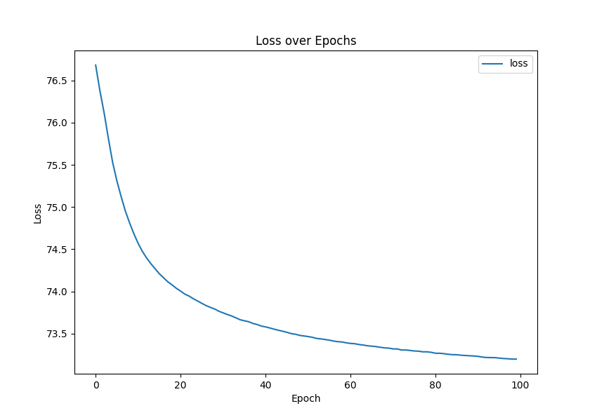
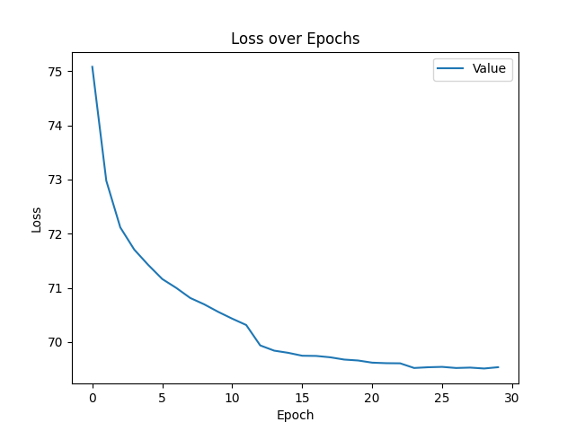

# 作业1：蛋白质二级结构预测

数据样例：

```
{'seq': 'AQVINTFDGVADYLQTYHKLPDNYITKSEAQALGWVASKGNLADVAPGKSIGGDIFSNREGKLPGKSGRTWREADINYTSGFRNSDRILYSSDWLIYKTTDHYQTFTKIR',
 'ssp': 'CCCCCCHHHHHHHHHHHCCCCCCEECHHHHHHHCCCHHHCCHHHHCCCCEEEEEEECCCCCCCCCCCCCCEEEEECCCCCCCCCCCEEEEECCCCEEEECCCCCCCEECC'}
```

输入字母表：20个氨基酸；输出字母表：3种二级结构。

3000个蛋白质序列，最短长度为60，最长长度为250，平均长度为148.6。

输入输出如何编码？如何实现变长输入输出？

## 网络输入输出

本作业采用one-hot编码输入输出。

思路1：固定输入输出为最大长度250。

则：

| 模型     | 输入张量形状  | 输出张量形状 |
| -------- | ------------- | ------------ |
| MLP      | (N, 250 * 20) | (N, 250 * 3) |
| ResNet1d | (N, 20, 250)  | (N, 250 * 3) |

N为训练样本数量。

这种方式经过实验后发现模型(mlp和resnet1d)训练后准确率均在39%左右，而且loss曲线没有明确拐点，推测模型处于欠拟合状态。

思路2：按固定长度切分训练样本，输入输出长度固定为切分长度

split_len 为切分长度

| 模型     | 输入张量形状        | 输出张量形状       |
| -------- | ------------------- | ------------------ |
| MLP      | (N, split_len * 20) | (N, split_len * 3) |
| ResNet1d | (N, 20, split_len)  | (N, split_len * 3) |

本实验采取思路2并取split_len = 20。为了统一的对比标准，MLP和ResNet1d均取相同的split_len。

## 样本划分

本实验仅进行了训练集和验证集划分，在训练开始前将样本进行随机划分为80%训练集，20%验证集。

## 结果

### mlp

网络结构为

```
Linear(20 * 20, 32) -> ReLu -> Linear(32, 20 * 3) -> softmax(20, 3)

input:torch.Size([19050, 400])
output:torch.Size([19050, 60])
----------------------------------------------------------------
        Layer (type)               Output Shape         Param #
================================================================
            Linear-1            [-1, 19050, 32]          12,832
              ReLU-2            [-1, 19050, 32]               0
            Linear-3            [-1, 19050, 60]           1,980
           Softmax-4                [-1, 20, 3]               0
================================================================
```

最后一层softmax对每3个输出做softmax，即每个位置的三个类别预测做softmax。



Valid data len: 600

Average q3 accuracy: 59.52078323115891%

Mean squared error: 0.7551768759005673%

最终在验证集上的准确率为 59.52 ± 0.76 %

若将模型tain的verbose设为True, 则可看到每个序列的预测结果以及Q3准确率

### resnet1d

实现代码更改自[resnet1d](https://github.com/hsd1503/resnet1d)`test_physionet.py`, 将resnet的输入输出参数更改，use_bn设为False, 其他参数未更改。模型为ResNet50。



Valid data len: 600                                                                              

Average q3 accuracy: 63.74675038164278%

Mean squared error: 0.7119044158372616%

最终在验证集上的准确率为 63.75 ± 0.71%

相比mlp准确率提升4.23%